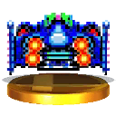

#  Blue-Falcon  [](http://kotlinlang.org) ![badge][badge-android] ![badge][badge-native] ![badge][badge-mac] ![badge][badge-rpi] ![badge][badge-js] ![badge][badge-windows] <a href="https://git.live"></a>

A Bluetooth BLE "Cross Platform" Kotlin Multiplatform library for iOS, Android, MacOS, Raspberry Pi, Windows and Javascript.

BLE in general has the same functionality for all platforms, e.g. connect to device, fetch services, fetch characteristics.

This library is the glue that brings those together so that mobile developers can use one common api to perform the BLE actions.

The idea is to have a common api for BLE devices as the principle of BLE is the same but each platform ios and android has different apis which means you have to duplicate the logic for each platform.

What this library isn't? It is not a cross platform library, this is a multiplatform library. The difference? each platform is compiled down to the native code, so when you use the library in iOS, you are consuming an obj-c library and same principle for Android and so on.

## Basic Usage

Include the library in your own KMP project as a dependency on your common target.

```
commonMain.dependencies {
    implementation("dev.bluefalcon:blue-falcon:2.0.0")
}
```

Once you have included it then you will need to create an instance of BlueFalcon and pass in an application context.

The Android sdk requires an Application context, we do this by passing in on the BlueFalcon constructor, in this example we are calling the code from an activity(this).

By passing in a string uuid of the service uuid, you can filter to scan for only devices that have that service.

```kotlin
try {
    val blueFalcon = BlueFalcon(log = null, ApplicationContext())
    blueFalcon.scan()
} catch (exception: PermissionException) {
    //request the ACCESS_COARSE_LOCATION permission
}
```

### Javascript 

#### Install

Simply copy the compiled javascript file (blue-falcon.js) to your web directory.

See the JS-Example for details on how to use.

### Windows

#### Requirements

- Windows 10 version 1803 (April 2018 Update) or later
- Java Development Kit (JDK) 11 or later

#### Building Native Library

The Windows implementation uses native Windows Bluetooth LE APIs through JNI (Java Native Interface). To build the native library:

1. Install Visual Studio 2019 or later with C++ development tools
2. Install Windows 10 SDK (version 10.0.17763.0 or later)
3. Navigate to `library/src/windowsMain/cpp`
4. Follow the build instructions in the README.md file in that directory

The implementation uses Windows Runtime (WinRT) APIs which are built into Windows 10, so no third-party dependencies are required.

#### Usage

```kotlin
// On Windows, ApplicationContext is empty but still required
val blueFalcon = BlueFalcon(log = null, ApplicationContext())
blueFalcon.scan()
```

Make sure the `bluefalcon-windows.dll` is in your Java library path or in the application's working directory.

### BlueFalcon API

The API provides a unified interface across all supported platforms. Below is the complete reference.

#### Initialization

```kotlin
val blueFalcon = BlueFalcon(
    log = PrintLnLogger,           // optional Logger implementation (null to disable)
    context = ApplicationContext(), // platform application context
    autoDiscoverAllServicesAndCharacteristics = true // auto-discover on connect
)
```

#### Scanning

```kotlin
// Start scanning for all nearby BLE devices
blueFalcon.scan()

// Scan with service UUID filters (only discover devices advertising specific services)
blueFalcon.scan(filters = listOf(serviceFilter))

// Stop scanning
blueFalcon.stopScanning()

// Clear all discovered peripherals
blueFalcon.clearPeripherals()

// Check scanning state
val scanning: Boolean = blueFalcon.isScanning
```

#### Observing Discovered Devices

```kotlin
// Observe discovered peripherals via StateFlow
blueFalcon.peripherals.collect { peripherals: Set<BluetoothPeripheral> ->
    // update your UI with the discovered devices
}

// Observe Bluetooth manager state (Ready / NotReady)
blueFalcon.managerState.collect { state: BluetoothManagerState ->
    when (state) {
        BluetoothManagerState.Ready -> { /* Bluetooth is available */ }
        BluetoothManagerState.NotReady -> { /* Bluetooth is unavailable */ }
    }
}
```

#### Connection Management

```kotlin
// Connect to a peripheral (autoConnect = false for direct connection)
blueFalcon.connect(bluetoothPeripheral, autoConnect = false)

// Disconnect from a peripheral
blueFalcon.disconnect(bluetoothPeripheral)

// Check current connection state
val state: BluetoothPeripheralState = blueFalcon.connectionState(bluetoothPeripheral)
// Returns: Connecting, Connected, Disconnected, Disconnecting, or Unknown

// Request connection priority (Android-specific, no-op on other platforms)
blueFalcon.requestConnectionPriority(bluetoothPeripheral, ConnectionPriority.High)
// Options: ConnectionPriority.Balanced, ConnectionPriority.High, ConnectionPriority.Low

// Retrieve a previously known peripheral by identifier
val peripheral: BluetoothPeripheral? = blueFalcon.retrievePeripheral("device-identifier")
// Android: MAC address format (e.g., "00:11:22:33:44:55")
// iOS/Native: UUID format (e.g., "XXXXXXXX-XXXX-XXXX-XXXX-XXXXXXXXXXXX")
```

#### Service & Characteristic Discovery

When `autoDiscoverAllServicesAndCharacteristics` is `true` (default), services and characteristics are discovered automatically after connection. You can also trigger discovery manually:

```kotlin
// Discover services (optionally filter by service UUIDs)
blueFalcon.discoverServices(bluetoothPeripheral, serviceUUIDs = emptyList())

// Discover characteristics for a specific service (optionally filter by UUIDs)
blueFalcon.discoverCharacteristics(
    bluetoothPeripheral,
    bluetoothService,
    characteristicUUIDs = emptyList()
)
```

#### Reading & Writing Characteristics

```kotlin
// Read a characteristic value
blueFalcon.readCharacteristic(bluetoothPeripheral, bluetoothCharacteristic)

// Write a string value
blueFalcon.writeCharacteristic(
    bluetoothPeripheral,
    bluetoothCharacteristic,
    value = "Hello",
    writeType = null // platform default write type
)

// Write raw bytes
blueFalcon.writeCharacteristic(
    bluetoothPeripheral,
    bluetoothCharacteristic,
    value = byteArrayOf(0x01, 0x02, 0x03),
    writeType = null
)

// Write raw bytes without encoding
blueFalcon.writeCharacteristicWithoutEncoding(
    bluetoothPeripheral,
    bluetoothCharacteristic,
    value = byteArrayOf(0x01, 0x02),
    writeType = null
)
```

#### Notifications & Indications

```kotlin
// Enable/disable notifications for a characteristic
blueFalcon.notifyCharacteristic(bluetoothPeripheral, bluetoothCharacteristic, notify = true)

// Enable/disable indications for a characteristic
blueFalcon.indicateCharacteristic(bluetoothPeripheral, bluetoothCharacteristic, indicate = true)

// Enable/disable both notifications and indications
blueFalcon.notifyAndIndicateCharacteristic(bluetoothPeripheral, bluetoothCharacteristic, enable = true)
```

#### Descriptor Operations

```kotlin
// Read a descriptor value
blueFalcon.readDescriptor(
    bluetoothPeripheral,
    bluetoothCharacteristic,
    bluetoothCharacteristicDescriptor
)

// Write a descriptor value
blueFalcon.writeDescriptor(
    bluetoothPeripheral,
    bluetoothCharacteristicDescriptor,
    value = byteArrayOf(0x01, 0x00)
)
```

#### MTU (Maximum Transmission Unit)

```kotlin
// Request a larger MTU size for the connection
blueFalcon.changeMTU(bluetoothPeripheral, mtuSize = 512)
```

#### L2CAP Channels

```kotlin
// Open an L2CAP channel with the given PSM (Protocol/Service Multiplexer)
blueFalcon.openL2capChannel(bluetoothPeripheral, psm = 128)
```

#### Bonding (Pairing)

```kotlin
// Create a bond with a peripheral
blueFalcon.createBond(bluetoothPeripheral)

// Remove an existing bond
blueFalcon.removeBond(bluetoothPeripheral)
```

### BlueFalconDelegate

Register a delegate to receive BLE event callbacks:

```kotlin
val delegate = object : BlueFalconDelegate {
    override fun didDiscoverDevice(
        bluetoothPeripheral: BluetoothPeripheral,
        advertisementData: Map<AdvertisementDataRetrievalKeys, Any>
    ) {
        // Called when a new device is discovered during scanning
    }

    override fun didConnect(bluetoothPeripheral: BluetoothPeripheral) {
        // Called when a peripheral connects successfully
    }

    override fun didDisconnect(bluetoothPeripheral: BluetoothPeripheral) {
        // Called when a peripheral disconnects
    }

    override fun didDiscoverServices(bluetoothPeripheral: BluetoothPeripheral) {
        // Called when services are discovered on a connected peripheral
    }

    override fun didDiscoverCharacteristics(bluetoothPeripheral: BluetoothPeripheral) {
        // Called when characteristics are discovered for a service
    }

    override fun didCharacteristcValueChanged(
        bluetoothPeripheral: BluetoothPeripheral,
        bluetoothCharacteristic: BluetoothCharacteristic
    ) {
        // Called when a characteristic value is read or updated via notification
    }

    override fun didWriteCharacteristic(
        bluetoothPeripheral: BluetoothPeripheral,
        bluetoothCharacteristic: BluetoothCharacteristic,
        success: Boolean
    ) {
        // Called after a characteristic write completes
    }

    override fun didUpdateNotificationStateFor(
        bluetoothPeripheral: BluetoothPeripheral,
        bluetoothCharacteristic: BluetoothCharacteristic
    ) {
        // Called when notification/indication state changes for a characteristic
    }

    override fun didRssiUpdate(bluetoothPeripheral: BluetoothPeripheral) {
        // Called when the RSSI value is updated for a peripheral
    }

    override fun didUpdateMTU(bluetoothPeripheral: BluetoothPeripheral, status: Int) {
        // Called when the MTU size is updated for a connection
    }

    override fun didReadDescriptor(
        bluetoothPeripheral: BluetoothPeripheral,
        bluetoothCharacteristicDescriptor: BluetoothCharacteristicDescriptor
    ) {
        // Called when a descriptor value is read
    }

    override fun didWriteDescriptor(
        bluetoothPeripheral: BluetoothPeripheral,
        bluetoothCharacteristicDescriptor: BluetoothCharacteristicDescriptor
    ) {
        // Called when a descriptor value is written
    }

    override fun didOpenL2capChannel(
        bluetoothPeripheral: BluetoothPeripheral,
        bluetoothSocket: BluetoothSocket?
    ) {
        // Called when an L2CAP channel is opened
    }

    override fun didBondStateChanged(
        bluetoothPeripheral: BluetoothPeripheral,
        state: BlueFalconBondState
    ) {
        // Called when the bond state changes (None, Bonding, Bonded)
    }
}

// Register the delegate
blueFalcon.delegates.add(delegate)

// Unregister when no longer needed
blueFalcon.delegates.remove(delegate)
```

All delegate methods have default empty implementations, so you only need to override the ones you are interested in.

### Key Data Types

| Type | Description |
|------|-------------|
| `BluetoothPeripheral` | Represents a BLE device with properties: `name`, `uuid`, `rssi`, `mtuSize`, `services`, `characteristics` |
| `BluetoothService` | A BLE service with `uuid`, `name`, and `characteristics` |
| `BluetoothCharacteristic` | A BLE characteristic with `uuid`, `name`, `value`, `descriptors`, `isNotifying`, and `service` |
| `BluetoothCharacteristicDescriptor` | A descriptor attached to a characteristic |
| `BluetoothPeripheralState` | Connection state: `Connecting`, `Connected`, `Disconnected`, `Disconnecting`, `Unknown` |
| `BluetoothManagerState` | Manager state: `Ready`, `NotReady` |
| `BlueFalconBondState` | Bond state: `None`, `Bonding`, `Bonded` |
| `ConnectionPriority` | Connection priority: `Balanced`, `High`, `Low` |
| `AdvertisementDataRetrievalKeys` | Advertisement data keys: `LocalName`, `ManufacturerData`, `ServiceUUIDsKey`, `IsConnectable` |

## Examples

This repo contains examples for kotlin MP, ios and android in the examples folder, install their dependencies, and run it locally:

### Compose Multiplatform

This example demonstrates using Kotlin Multiplatform Compose and Blue Falcon to build a full BLE application for Android and iOS with a shared UI. It demonstrates:

- **Device Scanning** — Discover nearby BLE peripherals and display them in a list sorted by signal strength
- **Connection Management** — Connect to and disconnect from BLE devices
- **Service & Characteristic Discovery** — Automatically discover and display services and characteristics in an expandable UI
- **Reading Characteristics** — Read characteristic values and display them as hex and UTF-8
- **Writing Characteristics** — Write string values to characteristics via a dialog
- **Notifications** — Toggle characteristic notifications on/off
- **Descriptor Operations** — Read descriptor values for characteristics
- **MTU Changes** — Request a custom MTU size and observe the result
- **RSSI & MTU Display** — View live RSSI and current MTU values in the device detail screen
- **Delegate Callbacks** — Full implementation of `BlueFalconDelegate` handling all BLE events

### Kotlin MP

This example demonstrates how to integrate Blue Falcon in your own project as a dependency on your library/project.

### Raspberry Pi

This example can only be ran on a Raspberry pi, it will crash otherwise.

### Javascript

Open the index.html file in a web browser.

## Logger

BlueFalcon has a constructor that takes a Logger, you can implement your own logger, to handle and reduce or add to the noise generated.

Look at the PrintLnLogger object of an example of how to do this.

## Contributing

We welcome contributions to Blue Falcon! For significant changes or new features, we use an AI-assisted workflow:

### 1. Create an Architecture Decision Record (ADR)

Before implementing major changes (new platforms, API changes, architectural decisions), create an ADR to document the decision:

```
# Ask your AI assistant:
"Create a new ADR for [your proposed change]"

# Or manually:
cp docs/adr/ADR-TEMPLATE.md docs/adr/NNNN-your-title.md
# Fill in the template and submit for review
```

ADRs help us:
- Document the "why" behind important decisions
- Consider alternatives and tradeoffs
- Onboard future contributors (including AI)
- Maintain architectural consistency

See existing ADRs in [`/docs/adr/`](docs/adr/) for examples.

### 2. Let AI Do the Heavy Lifting

Once your ADR is accepted, use AI tools to implement the changes:

```
# Example prompts for GitHub Copilot, Cursor, or other AI assistants:
"Implement the changes described in ADR 0001"
"Add [platform] support following the pattern in ADR 0001"
"Refactor [component] according to ADR NNNN"
```

Our codebase includes AI instructions (`.github/copilot-instructions.md`) to help assistants understand the project structure and conventions.

### 3. Contribution Guidelines

For detailed contribution guidelines, see [CONTRIBUTING.md](CONTRIBUTING.md). For questions or discussions, [file a Github issue](https://github.com/Reedyuk/blue-falcon/issues/new).

## Support

For a **bug, feature request, or cool idea**, please [file a Github issue](https://github.com/Reedyuk/blue-falcon/issues/new).

### Two big little things

Keep in mind that Blue-Falcon is maintained by volunteers. Please be patient if you don’t immediately get an answer to your question; we all have jobs, families, obligations, and lives beyond this project.

Many thanks to everyone so far who has contributed to the project, it really means alot.


[badge-android]: http://img.shields.io/badge/platform-android-brightgreen.svg?style=flat
[badge-native]: http://img.shields.io/badge/platform-native-lightgrey.svg?style=flat
[badge-js]: http://img.shields.io/badge/platform-js-yellow.svg?style=flat
[badge-mac]: http://img.shields.io/badge/platform-macos-lightgrey.svg?style=flat
[badge-rpi]: http://img.shields.io/badge/platform-rpi-lightgrey.svg?style=flat
[badge-windows]: http://img.shields.io/badge/platform-windows-blue.svg?style=flat
